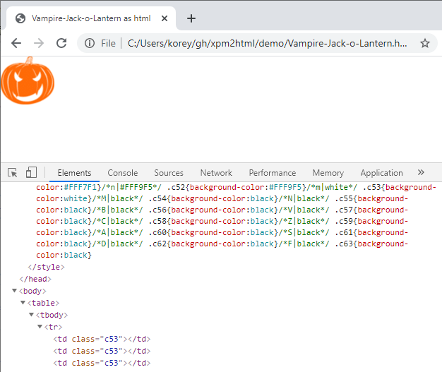

# xpm2html

Copyright (C) 2020 Korey Hinton. See LICENSE file

## NOTE

This current implementation requires images to be in XPM 3 format as outputted
from mogrify, and the image must have roughly only 90 different colors in it so
that each color is represented by exactly 1 character in the xpm file,
essentially the XPM must also be a true ascii art image.

If the image didn't turn out right, first thing to check is if the legend
inside the xpm file has multiple digits used in the lookup key.

## HACKTOBERFEST

I found myself wanting to read image pixel data from an image format that could
be easily parsed in code, and I found XPM to be in a human readable format that
could allow for that.

Once I got the image in that format I wondered which image viewer could view
this format. I realized it is so easy to parse and read it I could just write
out the pixels as an html table, each pixel being a TD tag.

I decided to use this as my 2020 Hacktoberfest contribution. It is not
thoroughly tested and will only work for images containing a small number of
colors since this code assumes 1 pixel is represented by just 1 character key
lookup in the xpm file.

Happy Halloween! - Korey 10/31/2020

## DEMO

```
# Make sure ImageMagick is installed and in PATH
# Test by running mogrify command

chmod +x xpm2html
PATH="${PATH}:${PWD}"

cd demo/
mogrify -format gif Vampire-Jack-o-Lantern.svg
mogrify -geometry x68 Vampire-Jack-o-Lantern.gif # height=68
mogrify -format xpm Vampire-Jack-o-Lantern.gif
# To see ascii art run:
#     cat Vampire-Jack-o-Lantern.xpm

# xpm to html conversion
cat Vampire-Jack-o-Lantern.xpm | xpm2html > Vampire-Jack-o-Lantern.html

# open Vampire-Jack-o-Lantern.html in the browser (img.html example below) 
```


